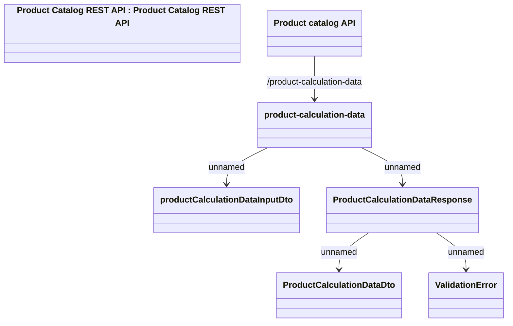

# Product Calculation Data

```mermaid
classDiagram
    class Product_Catalog_REST_API_Product_Catalog_REST_API["Product Catalog REST API : Product Catalog REST API"]
    class ValidationError["ValidationError"]
    class ProductCalculationDataDto["ProductCalculationDataDto"]
    class productCalculationDataInputDto["productCalculationDataInputDto"]
    class ProductCalculationDataResponse["ProductCalculationDataResponse"]
    class product_calculation_data["product-calculation-data"]
    class Product_catalog_API["Product catalog API"]
    product_calculation_data --> ProductCalculationDataResponse : unnamed
    product_calculation_data --> productCalculationDataInputDto : unnamed
    ProductCalculationDataResponse --> ProductCalculationDataDto : unnamed
    ProductCalculationDataResponse --> ValidationError : unnamed
    Product_catalog_API --> product_calculation_data : /product-calculation-data
```
