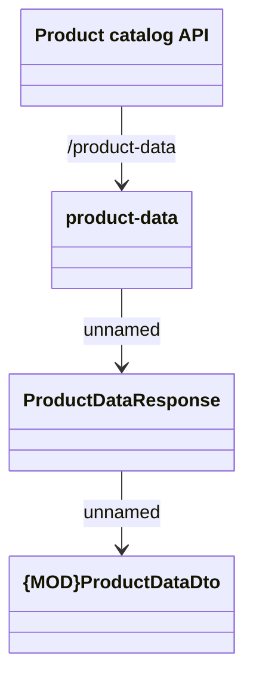

# Product Data

```mermaid
classDiagram
    class MOD_ProductDataDto["{MOD}ProductDataDto"]
    class ProductDataResponse["ProductDataResponse"]
    class product_data["product-data"]
    class Product_catalog_API["Product catalog API"]
    product_data --> ProductDataResponse : unnamed
    ProductDataResponse --> MOD_ProductDataDto : unnamed
    Product_catalog_API --> product_data : /product-data
```
