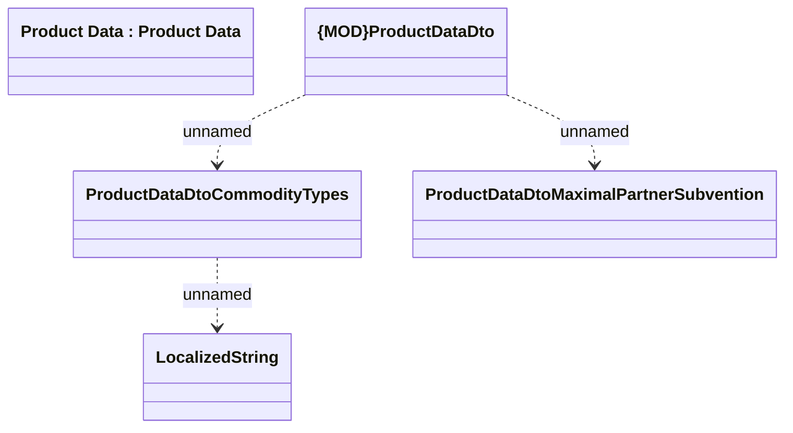

# ProductDataDto

- **Diagram Type**: Logical
- **Package**: HomerSelect/BSL/Modules/Product Catalog (PRC)/Interface Provided/Product Catalog REST API/Product Data
- **Diagram ID**: 158745
- **Elements**: 5
- **Connectors**: 3

