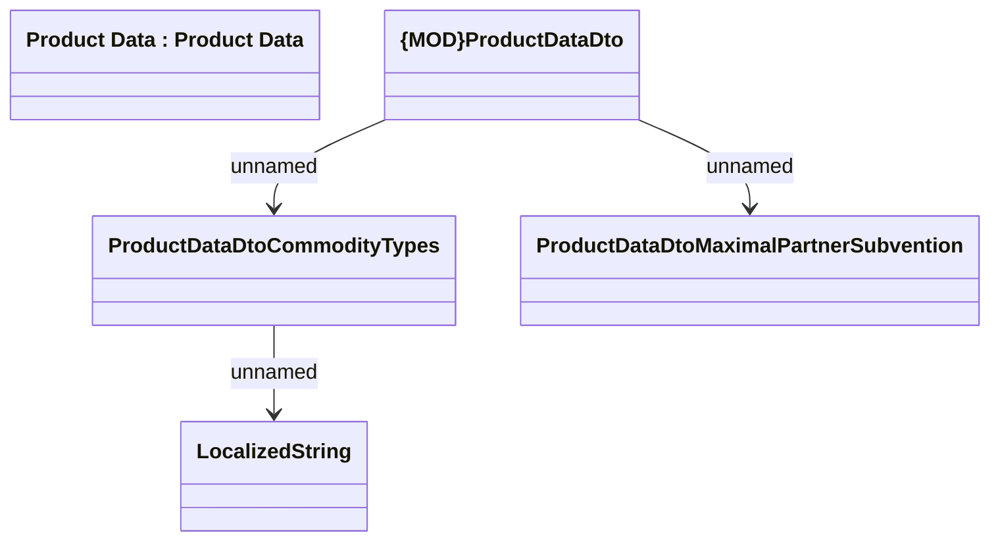

# ProductDataDto

```mermaid
classDiagram
    class Product_Data_Product_Data["Product Data : Product Data"]
    class LocalizedString["LocalizedString"]
    class ProductDataDtoCommodityTypes["ProductDataDtoCommodityTypes"]
    class ProductDataDtoMaximalPartnerSubvention["ProductDataDtoMaximalPartnerSubvention"]
    class MOD_ProductDataDto["{MOD}ProductDataDto"]
    MOD_ProductDataDto --> ProductDataDtoMaximalPartnerSubvention : unnamed
    MOD_ProductDataDto --> ProductDataDtoCommodityTypes : unnamed
    ProductDataDtoCommodityTypes --> LocalizedString : unnamed
```
