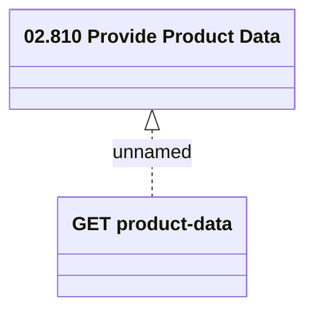

# Access Rights

- **Diagram Type**: Logical
- **Package**: HomerSelect/BSL/Modules/Product Catalog (PRC)/Interface Provided/Product Catalog REST API/Product Data/Access Rights
- **Diagram ID**: 158641
- **Elements**: 2
- **Connectors**: 1

