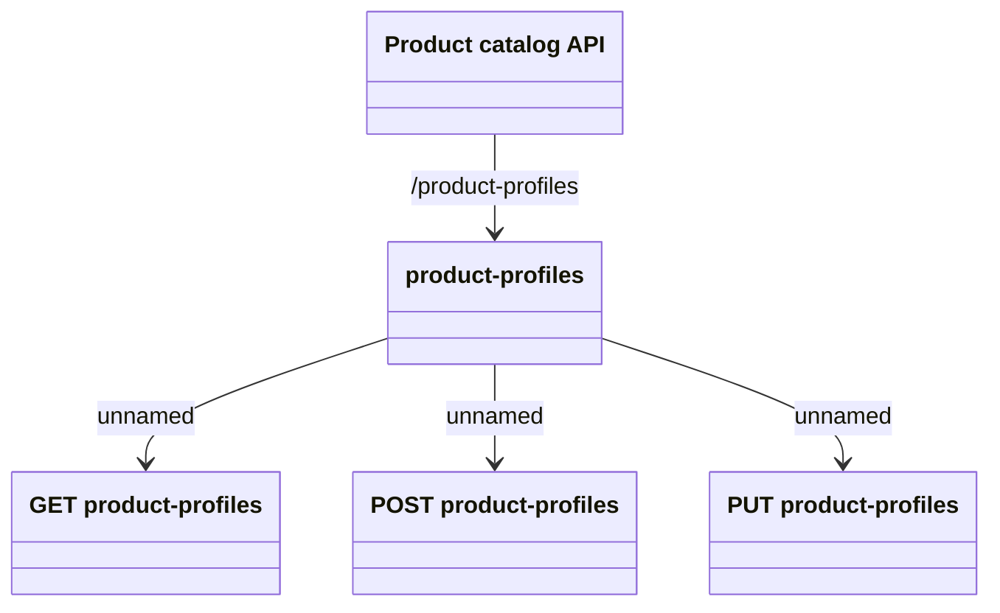

# Product Profile API

```mermaid
classDiagram
    class PUT_product_profiles["PUT product-profiles"]
    class POST_product_profiles["POST product-profiles"]
    class GET_product_profiles["GET product-profiles"]
    class Product_catalog_API["Product catalog API"]
    class product_profiles["product-profiles"]
    product_profiles --> GET_product_profiles : unnamed
    product_profiles --> POST_product_profiles : unnamed
    product_profiles --> PUT_product_profiles : unnamed
    Product_catalog_API --> product_profiles : /product-profiles
```
