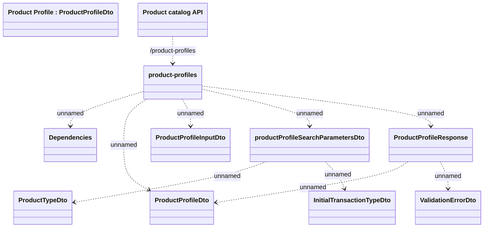

# Product Profile

- **Diagram Type**: Logical
- **Package**: HomerSelect/BSL/Modules/Product Catalog (PRC)/Interface Provided/Product Catalog REST API/Product Profile
- **Diagram ID**: 147521
- **Elements**: 11
- **Connectors**: 10

