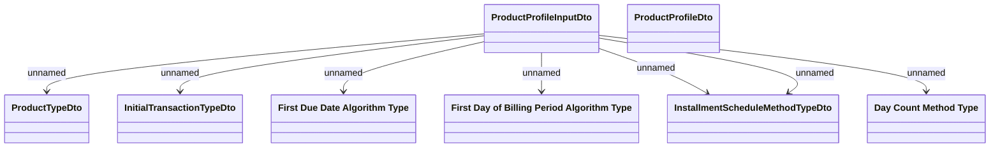

# ProductProfileDto

```mermaid
classDiagram
    class Day_Count_Method_Type["Day Count Method Type"]
    class InstallmentScheduleMethodTypeDto["InstallmentScheduleMethodTypeDto"]
    class First_Day_of_Billing_Period_Algorithm_Type["First Day of Billing Period Algorithm Type"]
    class First_Due_Date_Algorithm_Type["First Due Date Algorithm Type"]
    class ProductProfileInputDto["ProductProfileInputDto"]
    class InitialTransactionTypeDto["InitialTransactionTypeDto"]
    class ProductTypeDto["ProductTypeDto"]
    class ProductProfileDto["ProductProfileDto"]
    ProductProfileInputDto --> ProductTypeDto : unnamed
    ProductProfileInputDto --> InitialTransactionTypeDto : unnamed
    ProductProfileInputDto --> First_Due_Date_Algorithm_Type : unnamed
    ProductProfileInputDto --> First_Day_of_Billing_Period_Algorithm_Type : unnamed
    ProductProfileInputDto --> InstallmentScheduleMethodTypeDto : unnamed
    ProductProfileInputDto --> InstallmentScheduleMethodTypeDto : unnamed
    ProductProfileInputDto --> Day_Count_Method_Type : unnamed
```
