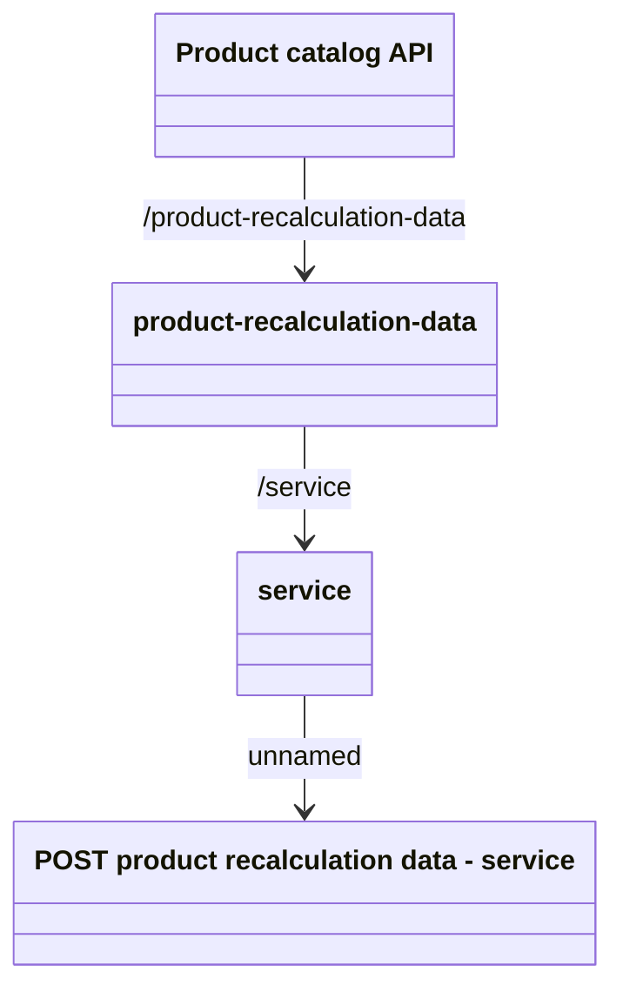

# Product Recalculation Data API

```mermaid
classDiagram
    class service["service"]
    class POST_product_recalculation_data_service["POST product recalculation data - service"]
    class Product_catalog_API["Product catalog API"]
    class product_recalculation_data["product-recalculation-data"]
    service --> POST_product_recalculation_data_service : unnamed
    product_recalculation_data --> service : /service
    Product_catalog_API --> product_recalculation_data : /product-recalculation-data
```
