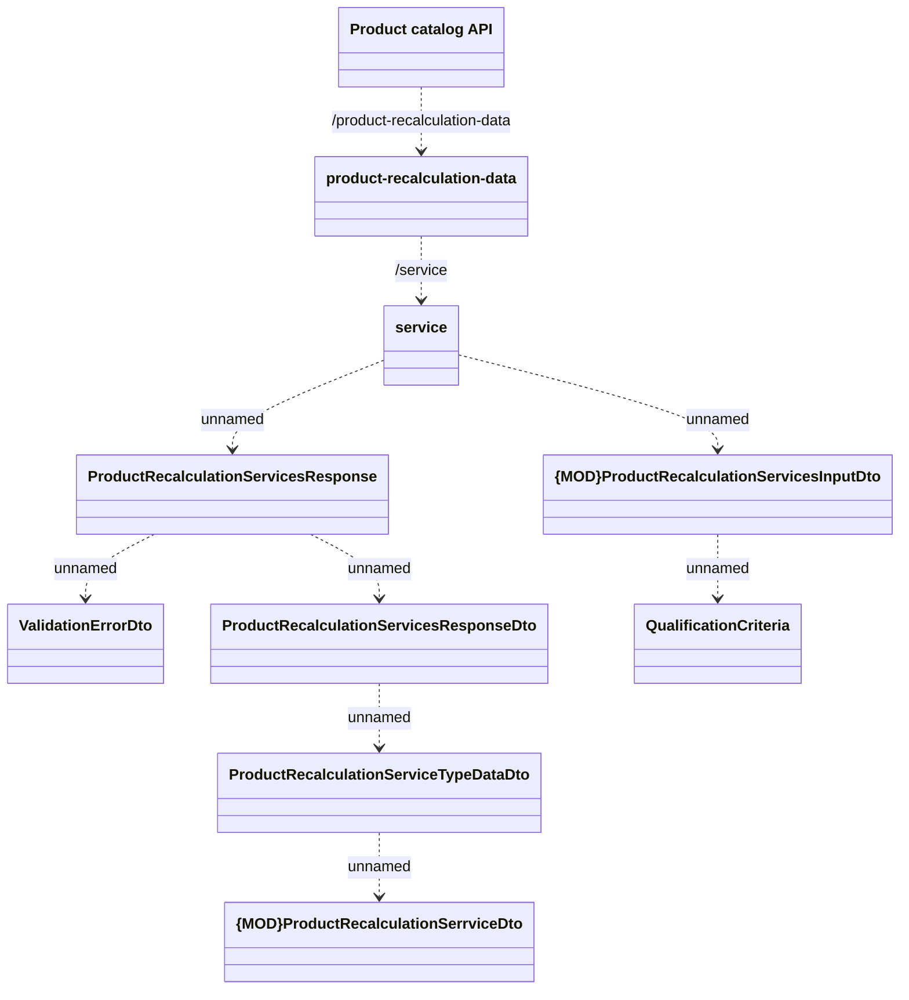

# Product Recalculation Data

- **Diagram Type**: Logical
- **Package**: HomerSelect/BSL/Modules/Product Catalog (PRC)/Interface Provided/Product Catalog REST API/Product Recalculation Data
- **Diagram ID**: 147043
- **Elements**: 10
- **Connectors**: 9

