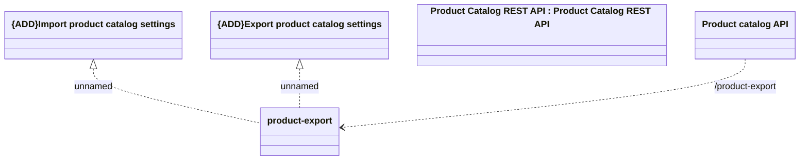

# Product catalog export/import API

- **Diagram Type**: Logical
- **Package**: HomerSelect/BSL/Modules/Product Catalog (PRC)/Interface Provided/Product Catalog REST API/Product catalog export/import
- **Diagram ID**: 163625
- **Elements**: 5
- **Connectors**: 3

