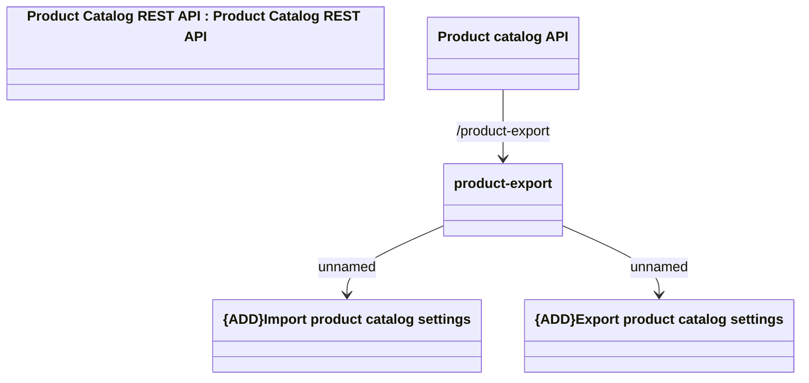

# Product catalog export/import API

```mermaid
classDiagram
    class ADD_Import_product_catalog_settings["{ADD}Import product catalog settings"]
    class ADD_Export_product_catalog_settings["{ADD}Export product catalog settings"]
    class Product_Catalog_REST_API_Product_Catalog_REST_API["Product Catalog REST API : Product Catalog REST API"]
    class product_export["product-export"]
    class Product_catalog_API["Product catalog API"]
    product_export --> ADD_Import_product_catalog_settings : unnamed
    product_export --> ADD_Export_product_catalog_settings : unnamed
    Product_catalog_API --> product_export : /product-export
```
