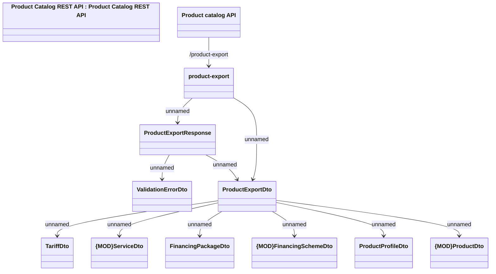

# Product catalog export/import

```mermaid
classDiagram
    class ValidationErrorDto["ValidationErrorDto"]
    class MOD_ProductDto["{MOD}ProductDto"]
    class ProductProfileDto["ProductProfileDto"]
    class MOD_FinancingSchemeDto["{MOD}FinancingSchemeDto"]
    class FinancingPackageDto["FinancingPackageDto"]
    class MOD_ServiceDto["{MOD}ServiceDto"]
    class TariffDto["TariffDto"]
    class ProductExportDto["ProductExportDto"]
    class ProductExportResponse["ProductExportResponse"]
    class product_export["product-export"]
    class Product_Catalog_REST_API_Product_Catalog_REST_API["Product Catalog REST API : Product Catalog REST API"]
    class Product_catalog_API["Product catalog API"]
    product_export --> ProductExportResponse : unnamed
    product_export --> ProductExportDto : unnamed
    ProductExportResponse --> ProductExportDto : unnamed
    ProductExportDto --> TariffDto : unnamed
    ProductExportDto --> MOD_ServiceDto : unnamed
    ProductExportDto --> FinancingPackageDto : unnamed
    ProductExportDto --> MOD_FinancingSchemeDto : unnamed
    ProductExportDto --> ProductProfileDto : unnamed
    ProductExportDto --> MOD_ProductDto : unnamed
    ProductExportResponse --> ValidationErrorDto : unnamed
    Product_catalog_API --> product_export : /product-export
```
