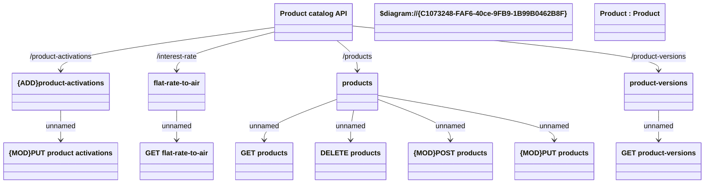

# Product API

```mermaid
classDiagram
    class MOD_PUT_product_activations["{MOD}PUT product activations"]
    class ADD_product_activations["{ADD}product-activations"]
    class Product_catalog_API["Product catalog API"]
    class diagram_C1073248_FAF6_40ce_9FB9_1B99B0462B8F["$diagram://{C1073248-FAF6-40ce-9FB9-1B99B0462B8F}"]
    class Product_Product["Product : Product"]
    class flat_rate_to_air["flat-rate-to-air"]
    class GET_flat_rate_to_air["GET flat-rate-to-air"]
    class GET_product_versions["GET product-versions"]
    class MOD_PUT_products["{MOD}PUT products"]
    class MOD_POST_products["{MOD}POST products"]
    class DELETE_products["DELETE products"]
    class GET_products["GET products"]
    class product_versions["product-versions"]
    class products["products"]
    products --> GET_products : unnamed
    products --> DELETE_products : unnamed
    products --> MOD_POST_products : unnamed
    products --> MOD_PUT_products : unnamed
    product_versions --> GET_product_versions : unnamed
    flat_rate_to_air --> GET_flat_rate_to_air : unnamed
    ADD_product_activations --> MOD_PUT_product_activations : unnamed
    Product_catalog_API --> ADD_product_activations : /product-activations
    Product_catalog_API --> flat_rate_to_air : /interest-rate
    Product_catalog_API --> products : /products
    Product_catalog_API --> product_versions : /product-versions
```
