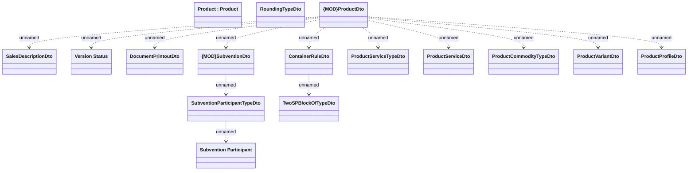

# ProductDto

- **Diagram Type**: Logical
- **Package**: HomerSelect/BSL/Modules/Product Catalog (PRC)/Interface Provided/Product Catalog REST API/Product
- **Diagram ID**: 161476
- **Elements**: 16
- **Connectors**: 13

