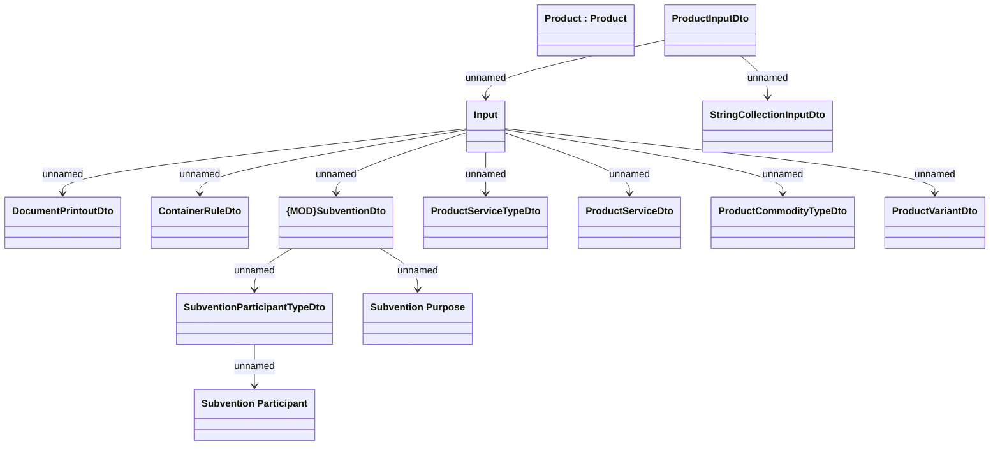

# ProductInputDto

```mermaid
classDiagram
    class Product_Product["Product : Product"]
    class Subvention_Participant["Subvention Participant"]
    class SubventionParticipantTypeDto["SubventionParticipantTypeDto"]
    class Subvention_Purpose["Subvention Purpose"]
    class DocumentPrintoutDto["DocumentPrintoutDto"]
    class ContainerRuleDto["ContainerRuleDto"]
    class MOD_SubventionDto["{MOD}SubventionDto"]
    class ProductServiceTypeDto["ProductServiceTypeDto"]
    class ProductServiceDto["ProductServiceDto"]
    class ProductCommodityTypeDto["ProductCommodityTypeDto"]
    class ProductVariantDto["ProductVariantDto"]
    class Input["Input"]
    class StringCollectionInputDto["StringCollectionInputDto"]
    class ProductInputDto["ProductInputDto"]
    ProductInputDto --> StringCollectionInputDto : unnamed
    ProductInputDto --> Input : unnamed
    MOD_SubventionDto --> Subvention_Purpose : unnamed
    MOD_SubventionDto --> SubventionParticipantTypeDto : unnamed
    SubventionParticipantTypeDto --> Subvention_Participant : unnamed
    Input --> ProductServiceDto : unnamed
    Input --> ContainerRuleDto : unnamed
    Input --> ProductCommodityTypeDto : unnamed
    Input --> DocumentPrintoutDto : unnamed
    Input --> ProductServiceTypeDto : unnamed
    Input --> MOD_SubventionDto : unnamed
    Input --> ProductVariantDto : unnamed
```
