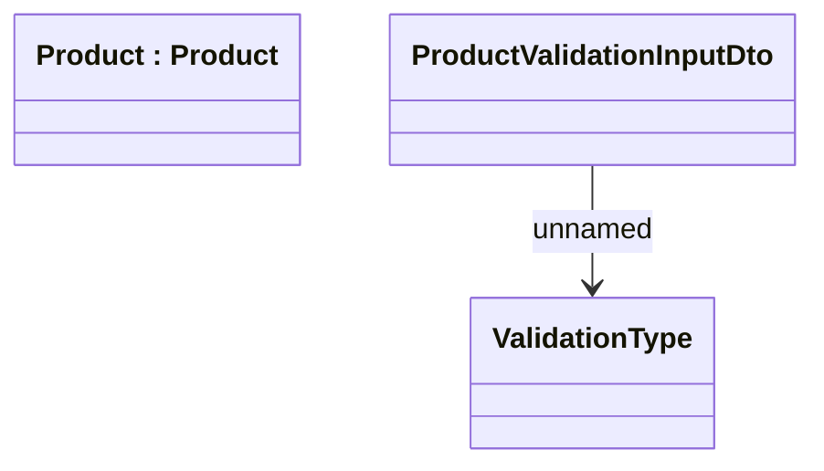

# ProductValidationInputDto 

```mermaid
classDiagram
    class Product_Product["Product : Product"]
    class ValidationType["ValidationType"]
    class ProductValidationInputDto["ProductValidationInputDto "]
    ProductValidationInputDto --> ValidationType : unnamed
```
