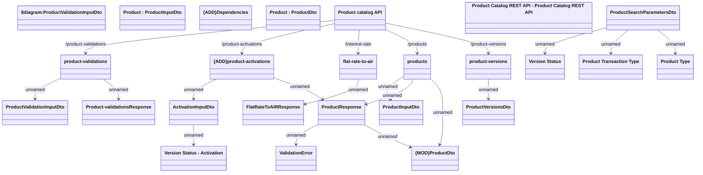

# Product

```mermaid
classDiagram
    class Version_Status_Activation["Version Status - Activation"]
    class ActivationInputDto["ActivationInputDto"]
    class ADD_product_activations["{ADD}product-activations"]
    class ProductValidationInputDto["ProductValidationInputDto "]
    class Product_validationsResponse["Product-validationsResponse"]
    class diagram_ProductValidationInputDto["$diagram:ProductValidationInputDto "]
    class product_validations["product-validations"]
    class FlatRateToAIRResponse["FlatRateToAIRResponse"]
    class flat_rate_to_air["flat-rate-to-air"]
    class ProductInputDto["ProductInputDto"]
    class Product_ProductInputDto["Product : ProductInputDto"]
    class ProductVersionsDto["ProductVersionsDto"]
    class product_versions["product-versions"]
    class ADD_Dependencies["{ADD}Dependencies"]
    class ValidationError["ValidationError"]
    class ProductResponse["ProductResponse"]
    class Product_ProductDto["Product : ProductDto"]
    class MOD_ProductDto["{MOD}ProductDto"]
    class Version_Status["Version Status"]
    class Product_Transaction_Type["Product Transaction Type"]
    class Product_Type["Product Type"]
    class ProductSearchParametersDto["ProductSearchParametersDto"]
    class products["products"]
    class Product_Catalog_REST_API_Product_Catalog_REST_API["Product Catalog REST API : Product Catalog REST API"]
    class Product_catalog_API["Product catalog API"]
    ProductResponse --> ValidationError : unnamed
    ADD_product_activations --> ActivationInputDto : unnamed
    product_validations --> ProductValidationInputDto : unnamed
    product_validations --> Product_validationsResponse : unnamed
    flat_rate_to_air --> FlatRateToAIRResponse : unnamed
    products --> ProductInputDto : unnamed
    product_versions --> ProductVersionsDto : unnamed
    products --> ProductResponse : unnamed
    ADD_product_activations --> ProductResponse : unnamed
    ProductResponse --> MOD_ProductDto : unnamed
    products --> MOD_ProductDto : unnamed
    ProductSearchParametersDto --> Version_Status : unnamed
    ProductSearchParametersDto --> Product_Transaction_Type : unnamed
    ProductSearchParametersDto --> Product_Type : unnamed
    ActivationInputDto --> Version_Status_Activation : unnamed
    Product_catalog_API --> product_validations : /product-validations
    Product_catalog_API --> ADD_product_activations : /product-activations
    Product_catalog_API --> flat_rate_to_air : /interest-rate
    Product_catalog_API --> products : /products
    Product_catalog_API --> product_versions : /product-versions
```
