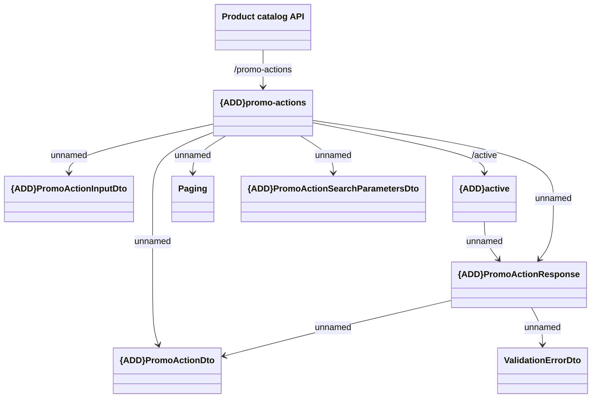

# Promo Actions

```mermaid
classDiagram
    class ADD_PromoActionInputDto["{ADD}PromoActionInputDto"]
    class ADD_active["{ADD}active"]
    class ValidationErrorDto["ValidationErrorDto"]
    class ADD_PromoActionResponse["{ADD}PromoActionResponse"]
    class Paging["Paging"]
    class ADD_PromoActionDto["{ADD}PromoActionDto"]
    class ADD_PromoActionSearchParametersDto["{ADD}PromoActionSearchParametersDto"]
    class ADD_promo_actions["{ADD}promo-actions"]
    class Product_catalog_API["Product catalog API"]
    ADD_promo_actions --> ADD_PromoActionSearchParametersDto : unnamed
    ADD_promo_actions --> ADD_PromoActionDto : unnamed
    ADD_PromoActionResponse --> ADD_PromoActionDto : unnamed
    ADD_promo_actions --> Paging : unnamed
    ADD_active --> ADD_PromoActionResponse : unnamed
    ADD_promo_actions --> ADD_PromoActionResponse : unnamed
    ADD_PromoActionResponse --> ValidationErrorDto : unnamed
    ADD_promo_actions --> ADD_active : /active
    ADD_promo_actions --> ADD_PromoActionInputDto : unnamed
    Product_catalog_API --> ADD_promo_actions : /promo-actions
```
