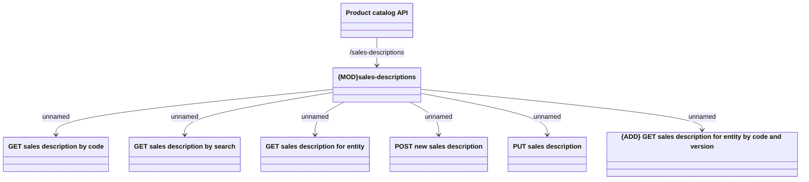

# Sales Descriptions API

```mermaid
classDiagram
    class ADD_GET_sales_description_for_entity_by_code_and_version["{ADD} GET sales description for entity by code and version"]
    class PUT_sales_description["PUT sales description"]
    class POST_new_sales_description["POST new sales description"]
    class GET_sales_description_for_entity["GET sales description for entity"]
    class GET_sales_description_by_search["GET sales description by search"]
    class GET_sales_description_by_code["GET sales description by code"]
    class MOD_sales_descriptions["{MOD}sales-descriptions"]
    class Product_catalog_API["Product catalog API"]
    MOD_sales_descriptions --> GET_sales_description_by_code : unnamed
    MOD_sales_descriptions --> GET_sales_description_by_search : unnamed
    MOD_sales_descriptions --> GET_sales_description_for_entity : unnamed
    MOD_sales_descriptions --> POST_new_sales_description : unnamed
    MOD_sales_descriptions --> PUT_sales_description : unnamed
    MOD_sales_descriptions --> ADD_GET_sales_description_for_entity_by_code_and_version : unnamed
    Product_catalog_API --> MOD_sales_descriptions : /sales-descriptions
```
