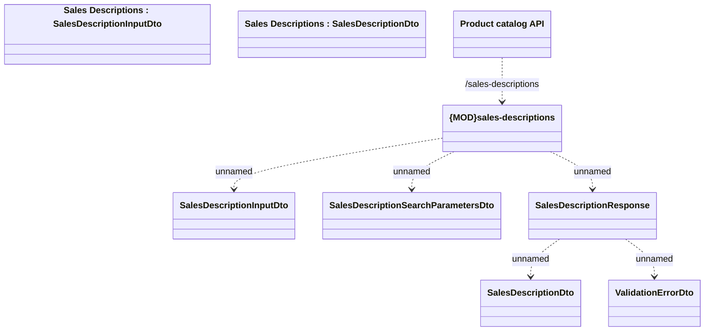

# Sales Descriptions

- **Diagram Type**: Logical
- **Package**: HomerSelect/BSL/Modules/Product Catalog (PRC)/Interface Provided/Product Catalog REST API/Sales Descriptions
- **Diagram ID**: 161065
- **Elements**: 9
- **Connectors**: 6

