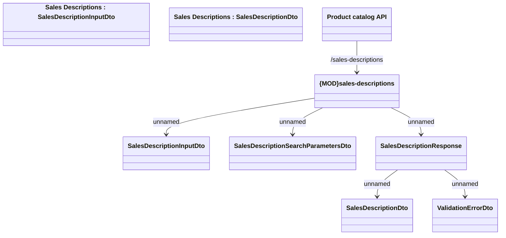

# Sales Descriptions

```mermaid
classDiagram
    class Sales_Descriptions_SalesDescriptionInputDto["Sales Descriptions : SalesDescriptionInputDto"]
    class SalesDescriptionInputDto["SalesDescriptionInputDto"]
    class Sales_Descriptions_SalesDescriptionDto["Sales Descriptions : SalesDescriptionDto"]
    class SalesDescriptionSearchParametersDto["SalesDescriptionSearchParametersDto"]
    class ValidationErrorDto["ValidationErrorDto"]
    class SalesDescriptionDto["SalesDescriptionDto"]
    class SalesDescriptionResponse["SalesDescriptionResponse"]
    class MOD_sales_descriptions["{MOD}sales-descriptions"]
    class Product_catalog_API["Product catalog API"]
    MOD_sales_descriptions --> SalesDescriptionResponse : unnamed
    SalesDescriptionResponse --> SalesDescriptionDto : unnamed
    SalesDescriptionResponse --> ValidationErrorDto : unnamed
    MOD_sales_descriptions --> SalesDescriptionSearchParametersDto : unnamed
    MOD_sales_descriptions --> SalesDescriptionInputDto : unnamed
    Product_catalog_API --> MOD_sales_descriptions : /sales-descriptions
```
