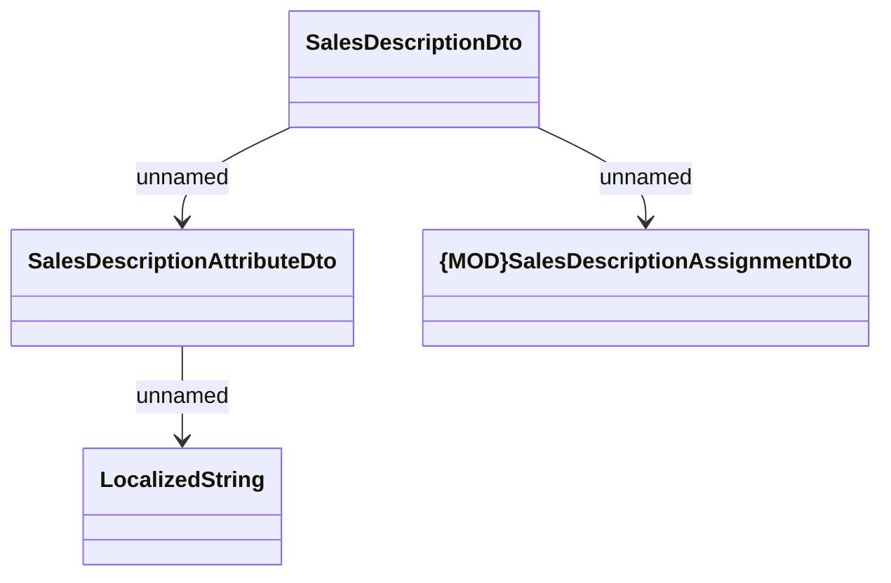

# SalesDescriptionDto

```mermaid
classDiagram
    class LocalizedString["LocalizedString"]
    class SalesDescriptionAttributeDto["SalesDescriptionAttributeDto"]
    class MOD_SalesDescriptionAssignmentDto["{MOD}SalesDescriptionAssignmentDto"]
    class SalesDescriptionDto["SalesDescriptionDto"]
    SalesDescriptionDto --> MOD_SalesDescriptionAssignmentDto : unnamed
    SalesDescriptionDto --> SalesDescriptionAttributeDto : unnamed
    SalesDescriptionAttributeDto --> LocalizedString : unnamed
```
