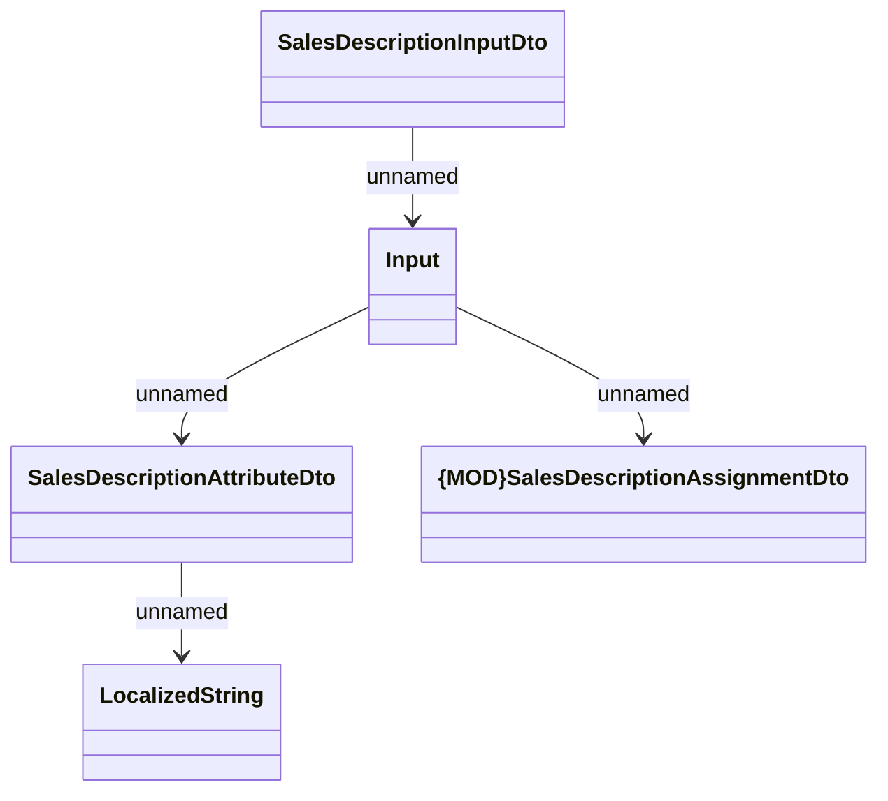

# SalesDescriptionInputDto

```mermaid
classDiagram
    class LocalizedString["LocalizedString"]
    class Input["Input"]
    class SalesDescriptionAttributeDto["SalesDescriptionAttributeDto"]
    class MOD_SalesDescriptionAssignmentDto["{MOD}SalesDescriptionAssignmentDto"]
    class SalesDescriptionInputDto["SalesDescriptionInputDto"]
    SalesDescriptionInputDto --> Input : unnamed
    SalesDescriptionAttributeDto --> LocalizedString : unnamed
    Input --> MOD_SalesDescriptionAssignmentDto : unnamed
    Input --> SalesDescriptionAttributeDto : unnamed
```
