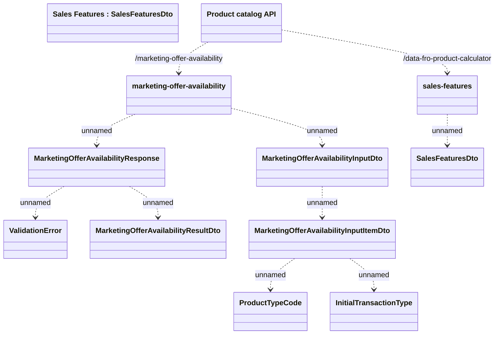

# Sales Features

- **Diagram Type**: Logical
- **Package**: HomerSelect/BSL/Modules/Product Catalog (PRC)/Interface Provided/Product Catalog REST API/Sales Features/Interface provided
- **Diagram ID**: 148878
- **Elements**: 12
- **Connectors**: 10

