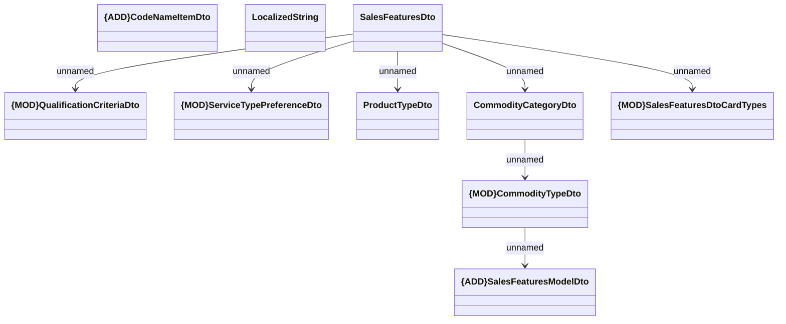

# SalesFeaturesDto

```mermaid
classDiagram
    class ADD_SalesFeaturesModelDto["{ADD}SalesFeaturesModelDto"]
    class MOD_QualificationCriteriaDto["{MOD}QualificationCriteriaDto"]
    class ADD_CodeNameItemDto["{ADD}CodeNameItemDto"]
    class MOD_ServiceTypePreferenceDto["{MOD}ServiceTypePreferenceDto"]
    class ProductTypeDto["ProductTypeDto"]
    class LocalizedString["LocalizedString"]
    class MOD_CommodityTypeDto["{MOD}CommodityTypeDto"]
    class CommodityCategoryDto["CommodityCategoryDto"]
    class MOD_SalesFeaturesDtoCardTypes["{MOD}SalesFeaturesDtoCardTypes"]
    class SalesFeaturesDto["SalesFeaturesDto"]
    SalesFeaturesDto --> MOD_SalesFeaturesDtoCardTypes : unnamed
    SalesFeaturesDto --> CommodityCategoryDto : unnamed
    SalesFeaturesDto --> ProductTypeDto : unnamed
    SalesFeaturesDto --> MOD_ServiceTypePreferenceDto : unnamed
    SalesFeaturesDto --> MOD_QualificationCriteriaDto : unnamed
    CommodityCategoryDto --> MOD_CommodityTypeDto : unnamed
    MOD_CommodityTypeDto --> ADD_SalesFeaturesModelDto : unnamed
```
