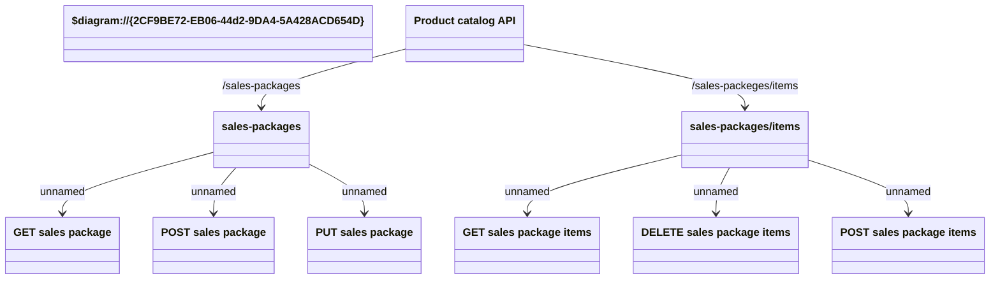

# Sales Packages API

```mermaid
classDiagram
    class diagram_2CF9BE72_EB06_44d2_9DA4_5A428ACD654D["$diagram://{2CF9BE72-EB06-44d2-9DA4-5A428ACD654D}"]
    class POST_sales_package_items["POST sales package items"]
    class DELETE_sales_package_items["DELETE sales package items"]
    class GET_sales_package_items["GET sales package items"]
    class PUT_sales_package["PUT sales package"]
    class POST_sales_package["POST sales package"]
    class GET_sales_package["GET sales package"]
    class sales_packages_items["sales-packages/items"]
    class sales_packages["sales-packages"]
    class Product_catalog_API["Product catalog API"]
    sales_packages --> GET_sales_package : unnamed
    sales_packages --> POST_sales_package : unnamed
    sales_packages --> PUT_sales_package : unnamed
    sales_packages_items --> GET_sales_package_items : unnamed
    sales_packages_items --> DELETE_sales_package_items : unnamed
    sales_packages_items --> POST_sales_package_items : unnamed
    Product_catalog_API --> sales_packages : /sales-packages
    Product_catalog_API --> sales_packages_items : /sales-packeges/items
```
