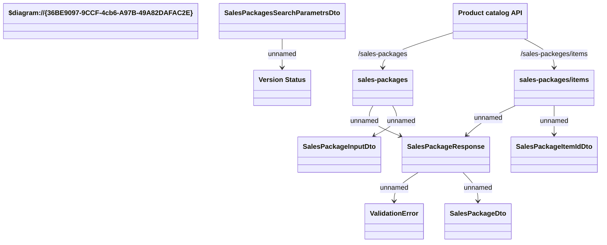

# Sales Packages

```mermaid
classDiagram
    class SalesPackageItemIdDto["SalesPackageItemIdDto"]
    class SalesPackageInputDto["SalesPackageInputDto"]
    class SalesPackageDto["SalesPackageDto"]
    class diagram_36BE9097_9CCF_4cb6_A97B_49A82DAFAC2E["$diagram://{36BE9097-9CCF-4cb6-A97B-49A82DAFAC2E}"]
    class ValidationError["ValidationError"]
    class SalesPackageResponse["SalesPackageResponse"]
    class Version_Status["Version Status"]
    class SalesPackagesSearchParametrsDto["SalesPackagesSearchParametrsDto"]
    class sales_packages_items["sales-packages/items"]
    class sales_packages["sales-packages"]
    class Product_catalog_API["Product catalog API"]
    SalesPackagesSearchParametrsDto --> Version_Status : unnamed
    sales_packages --> SalesPackageResponse : unnamed
    sales_packages_items --> SalesPackageResponse : unnamed
    SalesPackageResponse --> ValidationError : unnamed
    SalesPackageResponse --> SalesPackageDto : unnamed
    sales_packages --> SalesPackageInputDto : unnamed
    sales_packages_items --> SalesPackageItemIdDto : unnamed
    Product_catalog_API --> sales_packages : /sales-packages
    Product_catalog_API --> sales_packages_items : /sales-packeges/items
```
