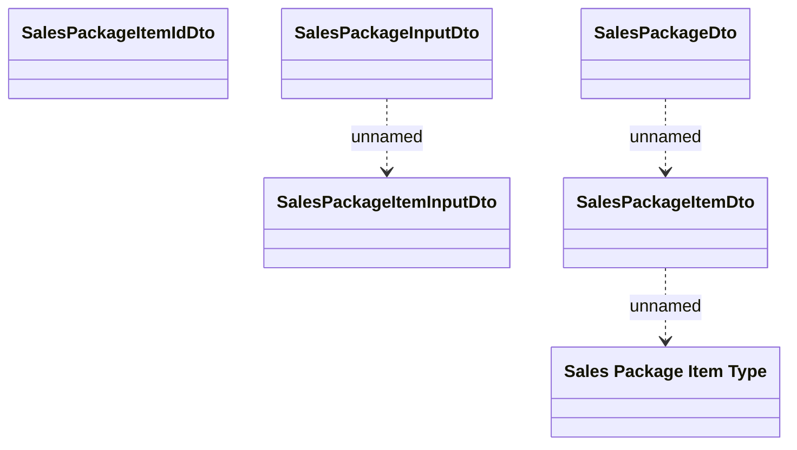

# SalesPackageDto

- **Diagram Type**: Logical
- **Package**: HomerSelect/BSL/Modules/Product Catalog (PRC)/Interface Provided/Product Catalog REST API/Sales Packages
- **Diagram ID**: 139122
- **Elements**: 6
- **Connectors**: 3

