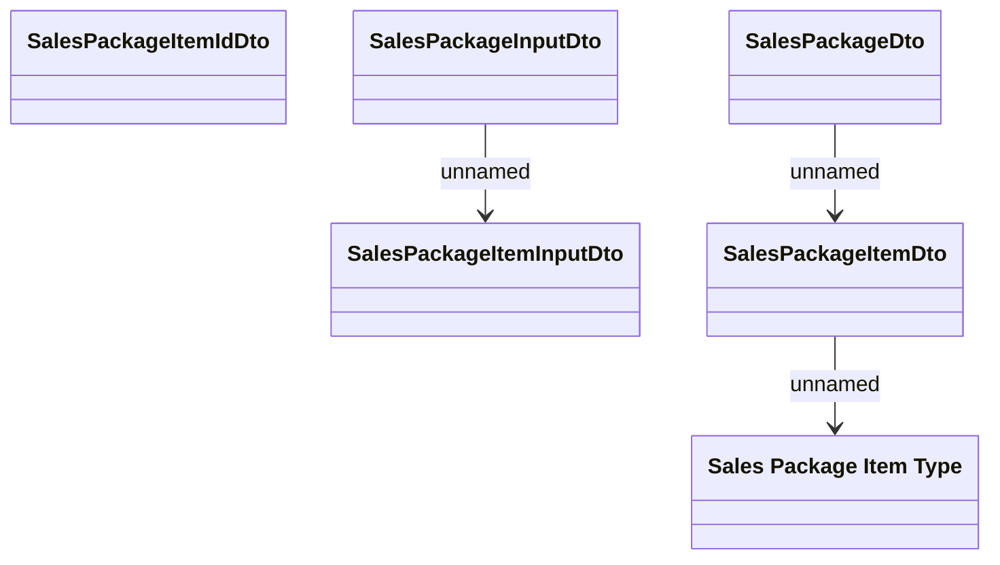

# SalesPackageDto

```mermaid
classDiagram
    class Sales_Package_Item_Type["Sales Package Item Type"]
    class SalesPackageItemIdDto["SalesPackageItemIdDto"]
    class SalesPackageItemInputDto["SalesPackageItemInputDto"]
    class SalesPackageInputDto["SalesPackageInputDto"]
    class SalesPackageItemDto["SalesPackageItemDto"]
    class SalesPackageDto["SalesPackageDto"]
    SalesPackageDto --> SalesPackageItemDto : unnamed
    SalesPackageInputDto --> SalesPackageItemInputDto : unnamed
    SalesPackageItemDto --> Sales_Package_Item_Type : unnamed
```
