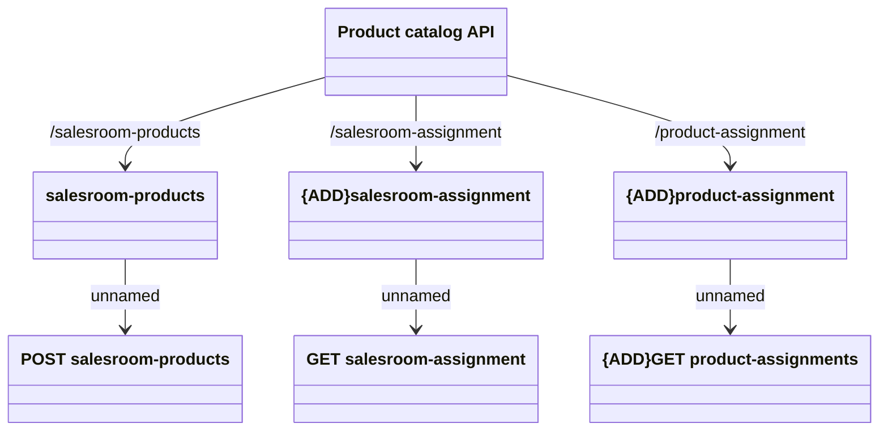

# Salesroom assignment API

```mermaid
classDiagram
    class ADD_GET_product_assignments["{ADD}GET product-assignments"]
    class ADD_product_assignment["{ADD}product-assignment"]
    class GET_salesroom_assignment["GET salesroom-assignment"]
    class ADD_salesroom_assignment["{ADD}salesroom-assignment"]
    class POST_salesroom_products["POST salesroom-products"]
    class salesroom_products["salesroom-products"]
    class Product_catalog_API["Product catalog API"]
    Product_catalog_API --> salesroom_products : /salesroom-products
    salesroom_products --> POST_salesroom_products : unnamed
    Product_catalog_API --> ADD_salesroom_assignment : /salesroom-assignment
    ADD_salesroom_assignment --> GET_salesroom_assignment : unnamed
    Product_catalog_API --> ADD_product_assignment : /product-assignment
    ADD_product_assignment --> ADD_GET_product_assignments : unnamed
```
