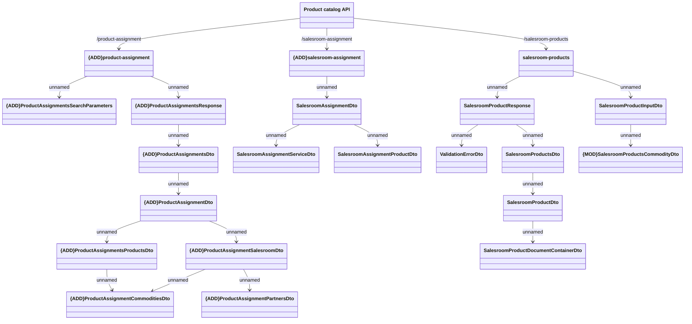

# Salesroom assignment

```mermaid
classDiagram
    class ADD_ProductAssignmentsSearchParameters["{ADD}ProductAssignmentsSearchParameters"]
    class ADD_ProductAssignmentsResponse["{ADD}ProductAssignmentsResponse"]
    class ADD_product_assignment["{ADD}product-assignment"]
    class ADD_ProductAssignmentSalesroomDto["{ADD}ProductAssignmentSalesroomDto"]
    class ADD_ProductAssignmentsProductsDto["{ADD}ProductAssignmentsProductsDto"]
    class ADD_ProductAssignmentCommoditiesDto["{ADD}ProductAssignmentCommoditiesDto"]
    class ADD_ProductAssignmentPartnersDto["{ADD}ProductAssignmentPartnersDto"]
    class ADD_ProductAssignmentDto["{ADD}ProductAssignmentDto"]
    class ADD_ProductAssignmentsDto["{ADD}ProductAssignmentsDto"]
    class SalesroomAssignmentServiceDto["SalesroomAssignmentServiceDto"]
    class SalesroomAssignmentProductDto["SalesroomAssignmentProductDto"]
    class SalesroomAssignmentDto["SalesroomAssignmentDto"]
    class ADD_salesroom_assignment["{ADD}salesroom-assignment"]
    class SalesroomProductResponse["SalesroomProductResponse"]
    class ValidationErrorDto["ValidationErrorDto"]
    class SalesroomProductDocumentContainerDto["SalesroomProductDocumentContainerDto"]
    class SalesroomProductDto["SalesroomProductDto"]
    class SalesroomProductsDto["SalesroomProductsDto"]
    class MOD_SalesroomProductsCommodityDto["{MOD}SalesroomProductsCommodityDto"]
    class SalesroomProductInputDto["SalesroomProductInputDto"]
    class salesroom_products["salesroom-products"]
    class Product_catalog_API["Product catalog API"]
    SalesroomProductDto --> SalesroomProductDocumentContainerDto : unnamed
    ADD_ProductAssignmentsProductsDto --> ADD_ProductAssignmentCommoditiesDto : unnamed
    ADD_ProductAssignmentSalesroomDto --> ADD_ProductAssignmentCommoditiesDto : unnamed
    ADD_ProductAssignmentsDto --> ADD_ProductAssignmentDto : unnamed
    ADD_ProductAssignmentsResponse --> ADD_ProductAssignmentsDto : unnamed
    SalesroomAssignmentDto --> SalesroomAssignmentServiceDto : unnamed
    SalesroomAssignmentDto --> SalesroomAssignmentProductDto : unnamed
    ADD_salesroom_assignment --> SalesroomAssignmentDto : unnamed
    Product_catalog_API --> ADD_salesroom_assignment : /salesroom-assignment
    ADD_ProductAssignmentDto --> ADD_ProductAssignmentsProductsDto : unnamed
    SalesroomProductResponse --> ValidationErrorDto : unnamed
    ADD_product_assignment --> ADD_ProductAssignmentsSearchParameters : unnamed
    SalesroomProductsDto --> SalesroomProductDto : unnamed
    SalesroomProductResponse --> SalesroomProductsDto : unnamed
    SalesroomProductInputDto --> MOD_SalesroomProductsCommodityDto : unnamed
    salesroom_products --> SalesroomProductInputDto : unnamed
    Product_catalog_API --> salesroom_products : /salesroom-products
    ADD_ProductAssignmentSalesroomDto --> ADD_ProductAssignmentPartnersDto : unnamed
    ADD_ProductAssignmentDto --> ADD_ProductAssignmentSalesroomDto : unnamed
    Product_catalog_API --> ADD_product_assignment : /product-assignment
    ADD_product_assignment --> ADD_ProductAssignmentsResponse : unnamed
    salesroom_products --> SalesroomProductResponse : unnamed
```
