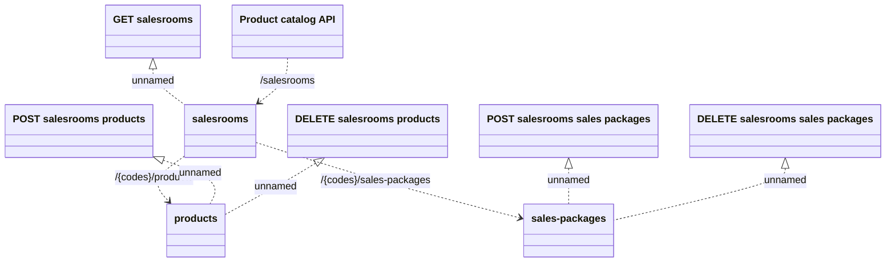

# Salesroom API

- **Diagram Type**: Logical
- **Package**: HomerSelect/BSL/Modules/Product Catalog (PRC)/Interface Provided/Product Catalog REST API/Salesroom
- **Diagram ID**: 149790
- **Elements**: 9
- **Connectors**: 8

