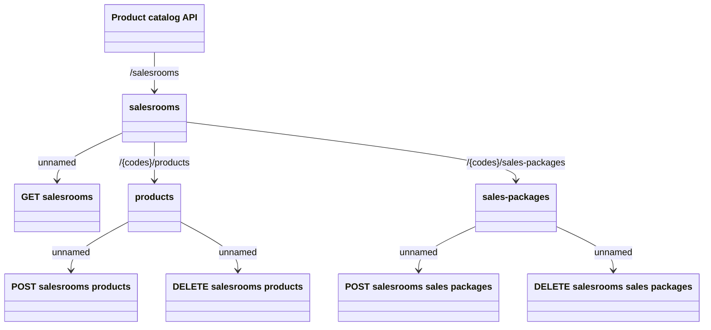

# Salesroom API

```mermaid
classDiagram
    class DELETE_salesrooms_sales_packages["DELETE salesrooms sales packages"]
    class POST_salesrooms_sales_packages["POST salesrooms sales packages"]
    class DELETE_salesrooms_products["DELETE salesrooms products"]
    class POST_salesrooms_products["POST salesrooms products"]
    class GET_salesrooms["GET salesrooms"]
    class sales_packages["sales-packages"]
    class products["products"]
    class salesrooms["salesrooms"]
    class Product_catalog_API["Product catalog API"]
    salesrooms --> products : /{codes}/products
    salesrooms --> sales_packages : /{codes}/sales-packages
    salesrooms --> GET_salesrooms : unnamed
    products --> POST_salesrooms_products : unnamed
    products --> DELETE_salesrooms_products : unnamed
    sales_packages --> POST_salesrooms_sales_packages : unnamed
    sales_packages --> DELETE_salesrooms_sales_packages : unnamed
    Product_catalog_API --> salesrooms : /salesrooms
```
