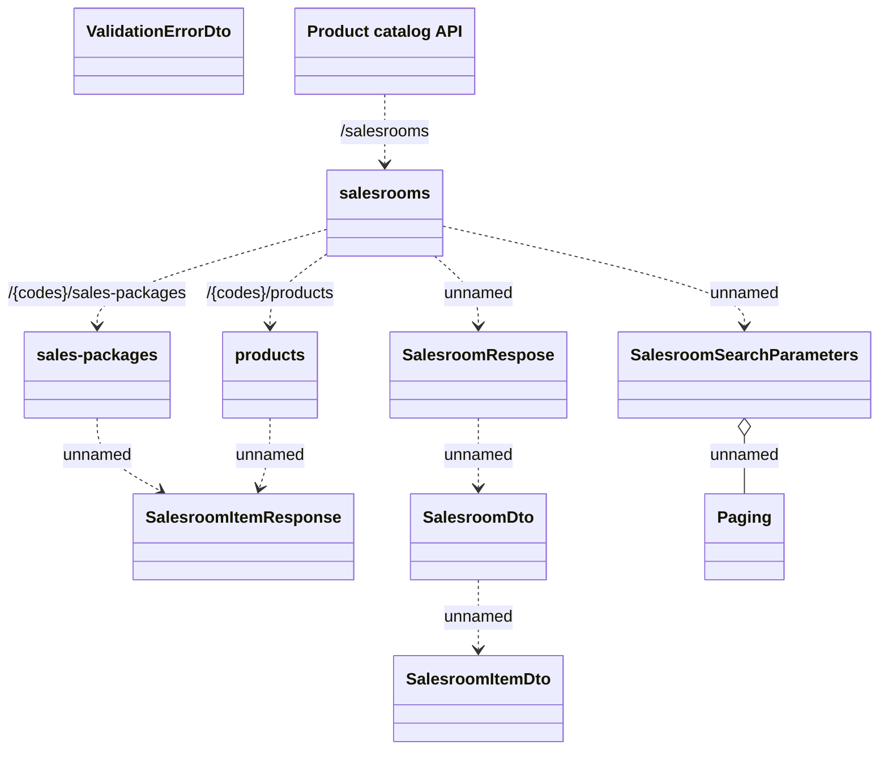

# Salesroom

- **Diagram Type**: Logical
- **Package**: HomerSelect/BSL/Modules/Product Catalog (PRC)/Interface Provided/Product Catalog REST API/Salesroom
- **Diagram ID**: 149789
- **Elements**: 11
- **Connectors**: 10

