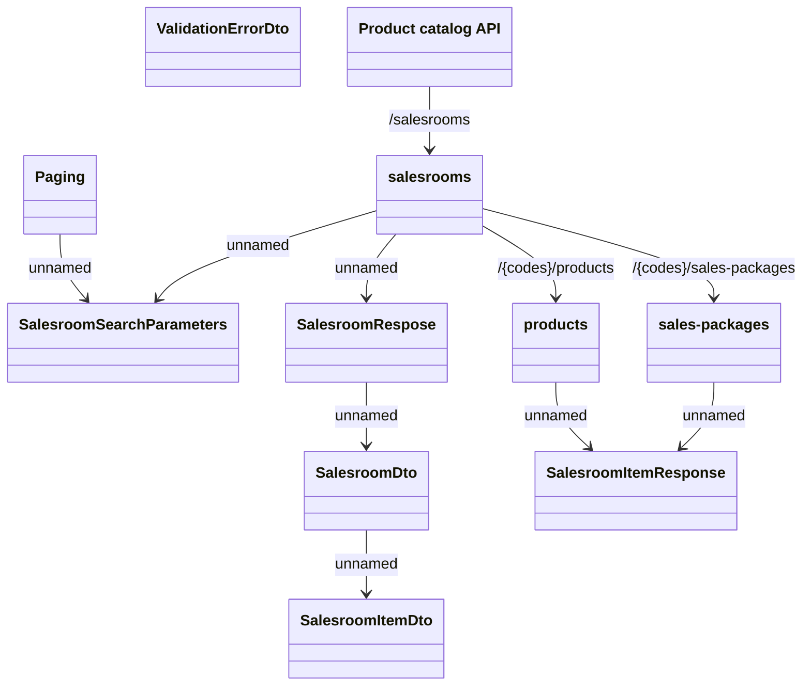

# Salesroom

```mermaid
classDiagram
    class sales_packages["sales-packages"]
    class SalesroomItemResponse["SalesroomItemResponse"]
    class products["products"]
    class ValidationErrorDto["ValidationErrorDto"]
    class SalesroomRespose["SalesroomRespose"]
    class SalesroomItemDto["SalesroomItemDto"]
    class SalesroomDto["SalesroomDto"]
    class Paging["Paging"]
    class SalesroomSearchParameters["SalesroomSearchParameters"]
    class salesrooms["salesrooms"]
    class Product_catalog_API["Product catalog API"]
    Paging --> SalesroomSearchParameters : unnamed
    salesrooms --> SalesroomSearchParameters : unnamed
    SalesroomRespose --> SalesroomDto : unnamed
    SalesroomDto --> SalesroomItemDto : unnamed
    salesrooms --> SalesroomRespose : unnamed
    salesrooms --> products : /{codes}/products
    sales_packages --> SalesroomItemResponse : unnamed
    products --> SalesroomItemResponse : unnamed
    salesrooms --> sales_packages : /{codes}/sales-packages
    Product_catalog_API --> salesrooms : /salesrooms
```
