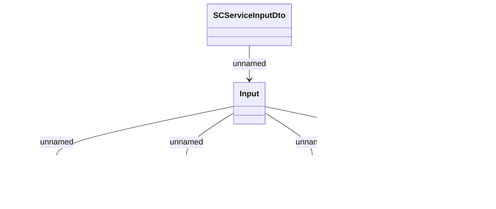

# SCServiceInputDto

```mermaid
classDiagram
    class ADD_SCServiceRoleDto["{ADD}SCServiceRoleDto"]
    class SCServiceRelationsDto["SCServiceRelationsDto"]
    class SCServiceCriterionDto["SCServiceCriterionDto"]
    class SCServiceParameterDto["SCServiceParameterDto"]
    class Input["Input"]
    class SCServiceInputDto["SCServiceInputDto"]
    SCServiceInputDto --> Input : unnamed
    Input --> ADD_SCServiceRoleDto : unnamed
    Input --> SCServiceParameterDto : unnamed
    Input --> SCServiceCriterionDto : unnamed
    Input --> SCServiceRelationsDto : unnamed
```
