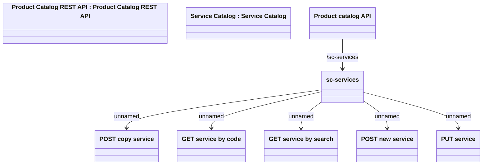

# Service Catalog API

```mermaid
classDiagram
    class Product_Catalog_REST_API_Product_Catalog_REST_API["Product Catalog REST API : Product Catalog REST API"]
    class Service_Catalog_Service_Catalog["Service Catalog : Service Catalog"]
    class PUT_service["PUT service"]
    class POST_new_service["POST new service"]
    class GET_service_by_search["GET service by search"]
    class GET_service_by_code["GET service by code"]
    class POST_copy_service["POST copy service"]
    class Product_catalog_API["Product catalog API"]
    class sc_services["sc-services"]
    sc_services --> POST_copy_service : unnamed
    sc_services --> GET_service_by_code : unnamed
    sc_services --> GET_service_by_search : unnamed
    sc_services --> POST_new_service : unnamed
    sc_services --> PUT_service : unnamed
    Product_catalog_API --> sc_services : /sc-services
```
