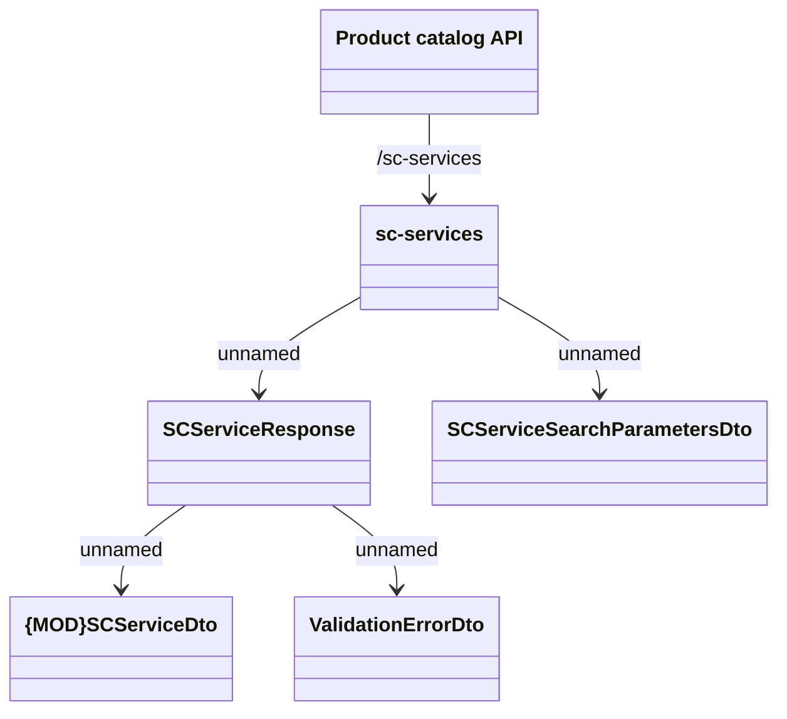

# Service Catalog

```mermaid
classDiagram
    class ValidationErrorDto["ValidationErrorDto"]
    class MOD_SCServiceDto["{MOD}SCServiceDto"]
    class SCServiceResponse["SCServiceResponse"]
    class SCServiceSearchParametersDto["SCServiceSearchParametersDto"]
    class sc_services["sc-services"]
    class Product_catalog_API["Product catalog API"]
    sc_services --> SCServiceSearchParametersDto : unnamed
    sc_services --> SCServiceResponse : unnamed
    SCServiceResponse --> MOD_SCServiceDto : unnamed
    SCServiceResponse --> ValidationErrorDto : unnamed
    Product_catalog_API --> sc_services : /sc-services
```
