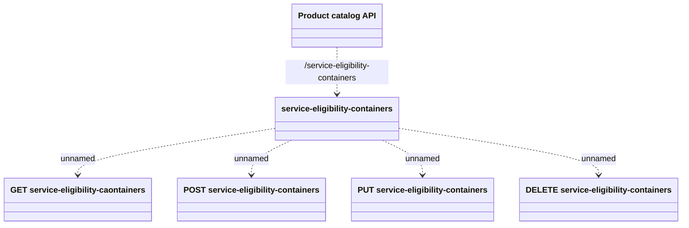

# Service Eligibility Containers API

- **Diagram Type**: Logical
- **Package**: HomerSelect/BSL/Modules/Product Catalog (PRC)/Interface Provided/Product Catalog REST API/Service Eligibility Containers
- **Diagram ID**: 139126
- **Elements**: 6
- **Connectors**: 5

