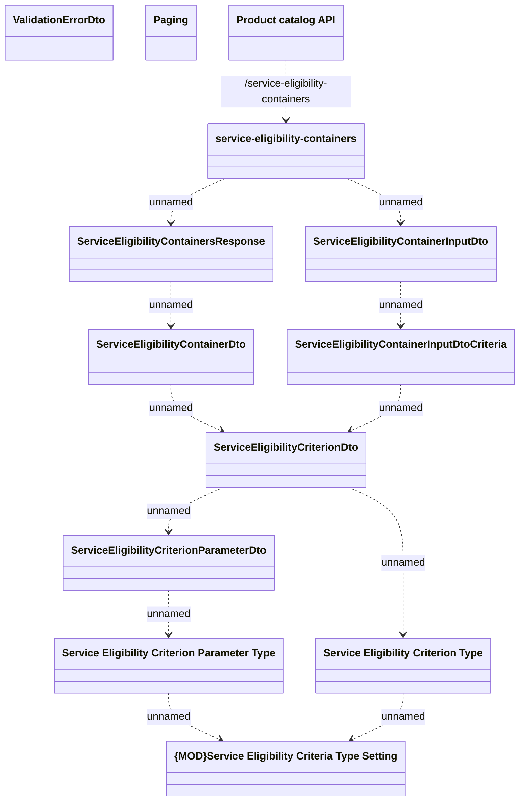

# Service Eligibility Containers

- **Diagram Type**: Logical
- **Package**: HomerSelect/BSL/Modules/Product Catalog (PRC)/Interface Provided/Product Catalog REST API/Service Eligibility Containers
- **Diagram ID**: 139125
- **Elements**: 13
- **Connectors**: 12

