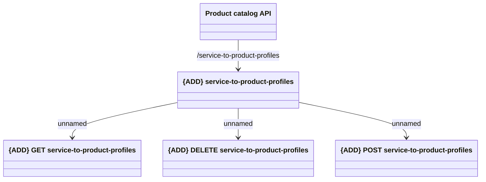

# Service to Product profile API

```mermaid
classDiagram
    class ADD_POST_service_to_product_profiles["{ADD} POST service-to-product-profiles"]
    class ADD_DELETE_service_to_product_profiles["{ADD} DELETE service-to-product-profiles"]
    class ADD_GET_service_to_product_profiles["{ADD} GET service-to-product-profiles"]
    class ADD_service_to_product_profiles["{ADD} service-to-product-profiles"]
    class Product_catalog_API["Product catalog API"]
    ADD_service_to_product_profiles --> ADD_GET_service_to_product_profiles : unnamed
    ADD_service_to_product_profiles --> ADD_DELETE_service_to_product_profiles : unnamed
    ADD_service_to_product_profiles --> ADD_POST_service_to_product_profiles : unnamed
    Product_catalog_API --> ADD_service_to_product_profiles : /service-to-product-profiles
```
