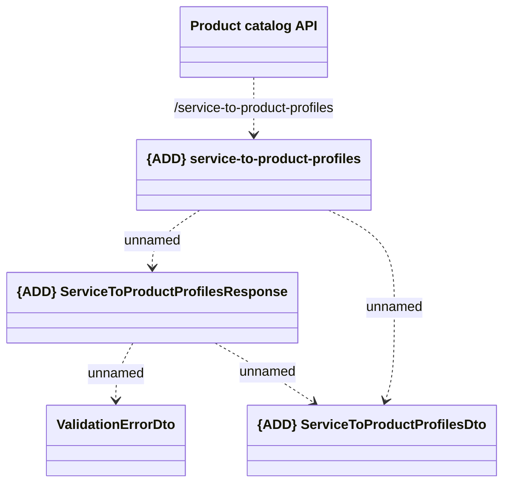

# Service to Product profile

- **Diagram Type**: Logical
- **Package**: HomerSelect/BSL/Modules/Product Catalog (PRC)/Interface Provided/Product Catalog REST API/Service to Product profile
- **Diagram ID**: 162962
- **Elements**: 5
- **Connectors**: 5

