# Service API

- **Diagram Type**: Logical
- **Package**: HomerSelect/BSL/Modules/Product Catalog (PRC)/Interface Provided/Product Catalog REST API/Services
- **Diagram ID**: 164631
- **Elements**: 16
- **Connectors**: 14

```mermaid
classDiagram
    class MOD_POST_service_offers["{MOD} POST service-offers"]
    class service_offers["service-offers"]
    class MOD_PUT_service_activations["{MOD}PUT service activations"]
    class service_activations["service-activations"]
    class PUT_service_relations["PUT service-relations"]
    class GET_service_relations["GET service-relations"]
    class diagram_C1073248_FAF6_40ce_9FB9_1B99B0462B8F["$diagram://{C1073248-FAF6-40ce-9FB9-1B99B0462B8F}"]
    class Product_catalog_API["Product catalog API"]
    class DELETE_services["DELETE services"]
    class GET_service_versions["GET service-versions"]
    class MOD_PUT_services["{MOD}PUT services"]
    class MOD_POST_services["{MOD}POST services"]
    class MOD_GET_services["{MOD}GET services"]
    class services["services"]
    class service_relations["service-relations"]
    class service_versions["service-versions"]
    Product_catalog_API ..> service_versions : /service-versions
    Product_catalog_API ..> service_relations : /service-relations
    Product_catalog_API ..> services : /services
    MOD_GET_services <|.. services : unnamed
    MOD_POST_services <|.. services : unnamed
    MOD_PUT_services <|.. services : unnamed
    GET_service_versions <|.. service_versions : unnamed
    DELETE_services <|.. services : unnamed
    GET_service_relations <|.. service_relations : unnamed
    PUT_service_relations <|.. service_relations : unnamed
    Product_catalog_API ..> service_activations : /service-activations
    MOD_PUT_service_activations <|.. service_activations : unnamed
    Product_catalog_API ..> service_offers : /service-offers
    MOD_POST_service_offers <|.. service_offers : unnamed
```

