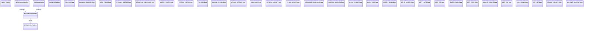

# Service Types

```mermaid
classDiagram
    class IBACK_IBACK["IBACK : IBACK"]
    class MOD_ServiceInputDto["{MOD}ServiceInputDto"]
    class ServiceParametersDto["ServiceParametersDto"]
    class MOD_ServiceDto["{MOD}ServiceDto"]
    class SMSN_SMSN_Data["SMSN :SMSN Data"]
    class PAS_PAS_Data["PAS : PAS Data"]
    class BUNDLE1_BUNDLE1_Data["BUNDLE1 : BUNDLE1 Data"]
    class RELIP_RELIP_Data["RELIP : RELIP Data"]
    class ZPROMO_ZPROMO_Data["ZPROMO : ZPROMO Data"]
    class RELPAYHOL_RELPAYHOL_Data["RELPAYHOL : RELPAYHOL Data"]
    class RELFER_RELFER_Data["RELFER : RELFER Data"]
    class PREFDD_PREFDD_Data["PREFDD : PREFDD Data"]
    class PER_PER_Data["PER : PER Data"]
    class PAYHOL_PAYHOL_Data["PAYHOL : PAYHOL Data"]
    class MTCACC_MTCACC_Data["MTCACC : MTCACC Data"]
    class LRES_LRES_Data["LRES : LRES Data"]
    class LOYALTY_LOYALTY_Data["LOYALTY : LOYALTY Data"]
    class IPPACK_IPPACK_Data["IPPACK : IPPACK Data"]
    class INSURANCE_INSURANCE_Data["INSURANCE : INSURANCE Data"]
    class CHECKTL_CHECKTL_Data["CHECKTL : CHECKTL Data"]
    class CHDDR_CHDDR_Data["CHDDR : CHDDR Data"]
    class CHDD_CHDD_Data["CHDD : CHDD Data"]
    class GRREL_GRREL_Data["GRREL : GRREL Data"]
    class GRPER_GRPER_Data["GRPER : GRPER Data"]
    class GIFTP_GIFTP_Data["GIFTP : GIFTP Data"]
    class FER_FER_Data["FER : FER Data"]
    class FBACK_FBACK_Data["FBACK : FBACK Data"]
    class DEFP_DEFP_Data["DEFP : DEFP Data"]
    class CRDPST_CRDPST_Data["CRDPST : CRDPST Data"]
    class COP_COP_Data["COP : COP Data"]
    class CONS_CONS_Data["CONS : CONS Data"]
    class CET_CET_Data["CET : CET Data"]
    class CELREW_CELREW_Data["CELREW : CELREW Data"]
    class ACCSTMT_ACCSTMT_Data["ACCSTMT : ACCSTMT Data"]
    class MOD_ServiceTypeDto["{MOD}ServiceTypeDto"]
    ServiceParametersDto --> MOD_ServiceTypeDto : one of
    MOD_ServiceInputDto --> ServiceParametersDto : unnamed
    MOD_ServiceDto --> ServiceParametersDto : unnamed
```
