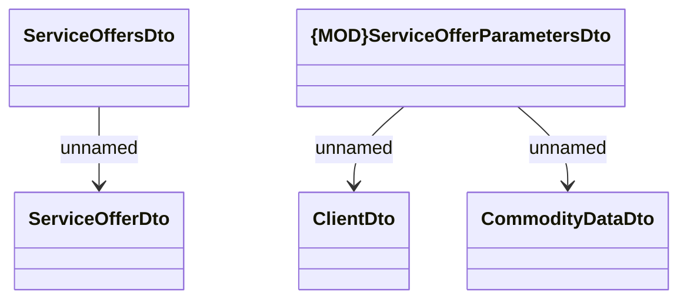

# Service offer

```mermaid
classDiagram
    class CommodityDataDto["CommodityDataDto"]
    class ServiceOfferDto["ServiceOfferDto"]
    class ServiceOffersDto["ServiceOffersDto"]
    class ClientDto["ClientDto"]
    class MOD_ServiceOfferParametersDto["{MOD}ServiceOfferParametersDto"]
    MOD_ServiceOfferParametersDto --> ClientDto : unnamed
    ServiceOffersDto --> ServiceOfferDto : unnamed
    MOD_ServiceOfferParametersDto --> CommodityDataDto : unnamed
```
