# Service

- **Diagram Type**: Logical
- **Package**: HomerSelect/BSL/Modules/Product Catalog (PRC)/Interface Provided/Product Catalog REST API/Services
- **Diagram ID**: 164630
- **Elements**: 28
- **Connectors**: 24

```mermaid
classDiagram
    class MOD_ServiceRelationsInputDto["{MOD}ServiceRelationsInputDto"]
    class ServiceOffersDto["ServiceOffersDto"]
    class ServiceOfferResponse["ServiceOfferResponse"]
    class ServiceOfferDto["ServiceOfferDto"]
    class Services_Service_offer["Services : Service offer"]
    class MOD_ServiceOfferParametersDto["{MOD}ServiceOfferParametersDto"]
    class service_offers["service-offers"]
    class Version_Status_Activation["Version Status - Activation"]
    class ActivationInputDto["ActivationInputDto"]
    class service_activations["service-activations"]
    class Version_Status["Version Status"]
    class Version_Status["Version Status"]
    class Product_catalog_API["Product catalog API"]
    class Service_Category["Service Category"]
    class diagram_Service_Types["$diagram:Service Types"]
    class MOD_ServiceTypeDto["{MOD}ServiceTypeDto"]
    class MOD_ServiceDto["{MOD}ServiceDto"]
    class MOD_ServiceInputDto["{MOD}ServiceInputDto"]
    class MOD_Dependencies["{MOD}Dependencies"]
    class ServiceVersionsDto["ServiceVersionsDto"]
    class ValidationErrorDto["ValidationErrorDto"]
    class diagram_4B1C27D4_7715_4627_8AC6_D97515AB3B56["$diagram://{4B1C27D4-7715-4627-8AC6-D97515AB3B56}"]
    class diagram_A0C2DA26_2DF1_4aba_885B_3B7E0344209B["$diagram://{A0C2DA26-2DF1-4aba-885B-3B7E0344209B}"]
    class service_versions["service-versions"]
    class service_relations["service-relations"]
    class ServiceSearchParametersDto["ServiceSearchParametersDto"]
    class ServiceResponse["ServiceResponse"]
    class services["services"]
    service_relations ..> ServiceResponse : unnamed
    ServiceSearchParametersDto ..> Service_Category : unnamed
    ServiceSearchParametersDto ..> MOD_ServiceTypeDto : unnamed
    ServiceResponse ..> MOD_ServiceDto : unnamed
    services ..> MOD_ServiceInputDto : unnamed
    services ..> MOD_Dependencies : unnamed
    service_versions ..> ServiceVersionsDto : unnamed
    ServiceResponse ..> ValidationErrorDto : unnamed
    Product_catalog_API ..> service_versions : /service-versions
    Product_catalog_API ..> service_relations : /service-relations
    ServiceSearchParametersDto ..> Version_Status : unnamed
    service_activations ..> ServiceResponse : unnamed
    Product_catalog_API ..> service_activations : /service-activations
    services ..> ServiceResponse : unnamed
    Product_catalog_API ..> services : /services
    service_relations ..> MOD_ServiceRelationsInputDto : unnamed
    ServiceOfferResponse ..> ServiceOffersDto : unnamed
    service_offers ..> ServiceOfferResponse : unnamed
    ServiceOffersDto ..> ServiceOfferDto : unnamed
    service_offers ..> MOD_ServiceOfferParametersDto : unnamed
    Product_catalog_API ..> service_offers : /service-offers
    ActivationInputDto ..> Version_Status_Activation : unnamed
    service_activations ..> ActivationInputDto : unnamed
    services ..> ServiceSearchParametersDto : unnamed
```

