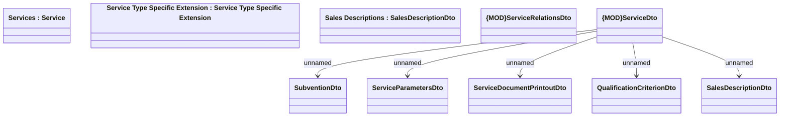

# ServiceDto

```mermaid
classDiagram
    class Services_Service["Services : Service"]
    class Service_Type_Specific_Extension_Service_Type_Specific_Extens["Service Type Specific Extension : Service Type Specific Extension"]
    class Sales_Descriptions_SalesDescriptionDto["Sales Descriptions : SalesDescriptionDto"]
    class SalesDescriptionDto["SalesDescriptionDto"]
    class QualificationCriterionDto["QualificationCriterionDto"]
    class ServiceDocumentPrintoutDto["ServiceDocumentPrintoutDto"]
    class ServiceParametersDto["ServiceParametersDto"]
    class MOD_ServiceRelationsDto["{MOD}ServiceRelationsDto"]
    class SubventionDto["SubventionDto"]
    class MOD_ServiceDto["{MOD}ServiceDto"]
    MOD_ServiceDto --> SubventionDto : unnamed
    MOD_ServiceDto --> ServiceParametersDto : unnamed
    MOD_ServiceDto --> ServiceDocumentPrintoutDto : unnamed
    MOD_ServiceDto --> QualificationCriterionDto : unnamed
    MOD_ServiceDto --> SalesDescriptionDto : unnamed
```
