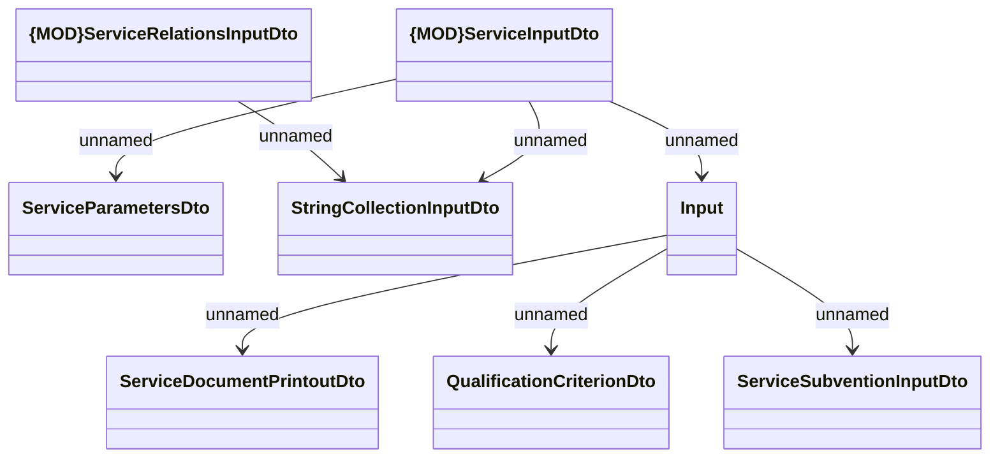

# ServiceInputDto

```mermaid
classDiagram
    class ServiceParametersDto["ServiceParametersDto"]
    class MOD_ServiceRelationsInputDto["{MOD}ServiceRelationsInputDto"]
    class ServiceSubventionInputDto["ServiceSubventionInputDto"]
    class QualificationCriterionDto["QualificationCriterionDto"]
    class StringCollectionInputDto["StringCollectionInputDto"]
    class ServiceDocumentPrintoutDto["ServiceDocumentPrintoutDto"]
    class Input["Input"]
    class MOD_ServiceInputDto["{MOD}ServiceInputDto"]
    MOD_ServiceInputDto --> Input : unnamed
    Input --> ServiceDocumentPrintoutDto : unnamed
    MOD_ServiceRelationsInputDto --> StringCollectionInputDto : unnamed
    MOD_ServiceInputDto --> StringCollectionInputDto : unnamed
    Input --> QualificationCriterionDto : unnamed
    Input --> ServiceSubventionInputDto : unnamed
    MOD_ServiceInputDto --> ServiceParametersDto : unnamed
```
