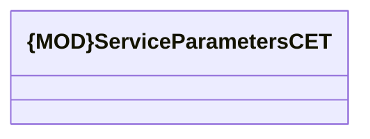

# CET Data

- **Diagram Type**: Logical
- **Package**: HomerSelect/BSL/Modules/Product Catalog (PRC)/Interface Provided/Product Catalog REST API/Services/Service Type Specific Extension/CET
- **Diagram ID**: 134524
- **Elements**: 1
- **Connectors**: 0

